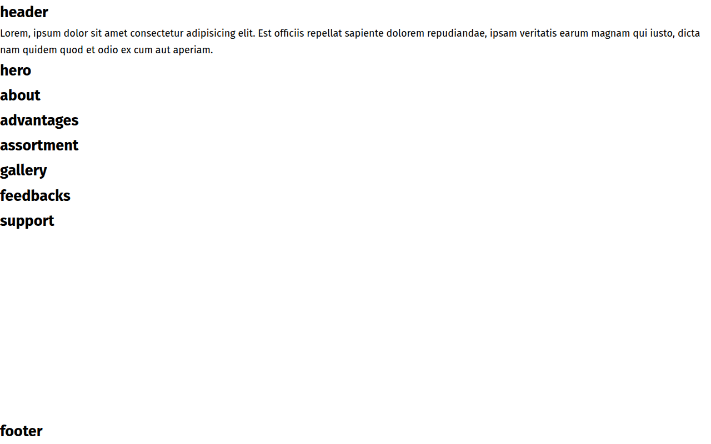

### 🌐 Choose your preferred language:

[🇺🇦 Ukrainian](README.md) | [🇬🇧 English](README.en.md) |
[🇩🇪 German](README.de.md)

# EcoTote — Style That Doesn't Harm the Planet 🌱

<!-- AUTOGEN:STATS -->
[](https://developer.mozilla.org/en-US/docs/Web/HTML) [](https://developer.mozilla.org/en-US/docs/Web/JavaScript) [](https://developer.mozilla.org/en-US/docs/Web/CSS) [](https://support.apple.com/guide/terminal/welcome/mac) [](https://code.visualstudio.com/) [](https://github.com/) [](https://www.figma.com/) 

[](https://github.com/VuToV-Mykola/project-new-generation-25/graphs/traffic)
[](https://github.com/VuToV-Mykola/project-new-generation-25/actions/workflows/screenshot-and-visitor.yaml)
[](https://github.com/VuToV-Mykola/project-new-generation-25)
[](https://github.com/VuToV-Mykola/project-new-generation-25/blob/main/LICENSE)

## 📸 Скріншот проекту

<!-- END:AUTOGEN -->

## 📋 Table of Contents

- [About the Project](#about-the-project)
- [Project Resources](#project-resources)
- [Technologies](#technologies)
- [Project Structure](#project-structure)
- [Layout Requirements](#layout-requirements)
- [Website Sections](#website-sections)
- [Installation](#installation)
- [Commands](#commands)
- [Validation](#validation)
- [MVP Checklist](#mvp-checklist)
- [Authors](#authors)

---

## 🎯 About the Project

**EcoTote** is a modern single-page (Landing Page) website dedicated to eco-friendly bags. The project demonstrates an environmentally responsible approach to consumption through stylish and practical textile bags.

### Key Features:
- ✅ Fully responsive layout (Mobile First)
- ✅ Semantic HTML5 markup
- ✅ Valid code (HTML, CSS, JS)
- ✅ Optimized graphics (SVG sprite, Retina ready)
- ✅ Accessibility (A11y)
- ✅ SEO optimization

---

## 🎨 Project Resources

### 📎 Resource Links

| Resource | Link |
|----------|------|
| 🎯 **Figma Design** | [Open Design](https://www.figma.com/design/RCf95cRtisUxC8gsNFAFAp/EcoTote?node-id=5999-10563&t=nWranbIbojsrBZff-1) |
| 📋 **Technical Specification** | [Google Sheets Specs](https://docs.google.com/spreadsheets/d/1cjTCqYsdTgFdQEhpCfu-b9m1uorSlAUOegU3T4HzVOQ/edit?usp=sharing) |
| 👩‍🏫 **Project Mentor** | @Oksana mentor |

### 📚 Additional Materials

- [How to Prepare for Team HTML+CSS Project](https://goit.global/)
- [How to Submit Project Homework in LMS](https://www.youtube.com/@GoITclub)

---

## 🛠 Technologies

| Technology | Purpose |
|------------|---------|
| **HTML5** | Semantic page structure |
| **CSS3** | Styling with Mobile First approach |
| **JavaScript (ES2025)** | Interactivity (burger menu, forms) |
| **Vite** | Project build and optimization |
| **Modern Normalize** | Browser styles normalization |
| **SVG Sprite** | Icon optimization |

---

## 📁 Project Structure

```
project-new-generation-25/
├── src/
│   ├── index.html              # Main page
│   ├── main.js                 # Main JS file
│   ├── css/                    # Styles
│   │   ├── reset.css           # Style reset
│   │   ├── base.css            # Base styles
│   │   ├── container.css       # Container
│   │   ├── header.css          # Header
│   │   ├── hero.css            # Hero section
│   │   ├── feature.css         # About eco-bags section
│   │   ├── advantages.css      # Advantages section
│   │   ├── product.css         # Assortment section
│   │   ├── gallery.css         # Gallery section
│   │   ├── testimonial.css     # Testimonials section
│   │   ├── contact.css         # Support form section
│   │   ├── footer.css          # Footer
│   │   └── styles.css          # Main styles file
│   ├── img/                    # Images
│   │   ├── icons.svg           # SVG sprite
│   │   └── icons/              # Individual icons
│   ├── partials/               # HTML partials
│   │   ├── header.html
│   │   ├── hero.html
│   │   ├── feature.html
│   │   ├── advantages.html
│   │   ├── product.html
│   │   ├── gallery.html
│   │   ├── testimonial.html
│   │   ├── contact.html
│   │   └── footer.html
│   └── public/
│       └── favicon.svg         # Site favicon
├── logs/                       # Logs and debug files
├── package.json                # Project dependencies
├── vite.config.js              # Vite configuration
└── README.md                   # Documentation
```

---

## 📐 Layout Requirements

### Responsive Design

The layout adapts to different screen sizes with breakpoints:

| Device | Screen Width |
|--------|--------------|
| **Mobile** | from 320px |
| **Tablet** | from 768px |
| **Desktop** | from 1440px |

### Validation

Code must pass validation:
- HTML5: [W3C Validator](https://validator.w3.org/)
- CSS3: [CSS Validator](https://jigsaw.w3.org/css-validator/)
- JavaScript: [JSHint](https://jshint.com/)

### Optimization

- ✅ Retina screen support (2x, 3x)
- ✅ Lazy loading for images
- ✅ SVG sprite for all icons (except logo)
- ✅ Graphics size optimization
- ✅ Custom fonts connection

### Interactivity

All clickable elements have:
- `:hover` - style changes on hover
- `:focus` - styling when focused
- `:active` - styling when pressed
- `cursor: pointer` - cursor change

---

## 🧱 Website Sections

### 1. **Header**

#### Desktop version:
- **Logo** - SVG icon with text (anchor link to home)
- **Navigation menu** - anchor links to sections:
  - About → `#about`
  - Advantages → `#advantages`
  - Assortment → `#assortment`
  - Gallery → `#gallery`
  - Reviews → `#feedbacks`
  - Contacts → `#support`
- **Contact information**:
  - Phone: `<a href="tel:+380...">` 
  - Email: `<a href="mailto:...@ecotote.ua">`

#### Mobile/Tablet version:
- Logo (left)
- Burger menu button (right)
- **Burger menu** opens via `.is-open` class

---

### 2. **Hero Section**

```html
<h1>EcoTote — Style That Doesn't Harm the Planet</h1>
```

- Main site heading (`<h1>`)
- Call-to-action text
- "Buy Now" button → anchor link to `#assortment`
- Content image (``)

---

### 3. **About** (About Eco-Bags)

```html
<h2>Natural</h2>
<p>Caring for the Planet</p>
```

- Section heading (`<h2>`)
- Subheading
- Materials description
- Background image (`background-image`)

---

### 4. **Advantages**

```html
<p>Advantages</p>
<h2>Why Choose Us?</h2>
```

- List of advantages via `<ul>`
- Each card contains:
  - Content image
  - Heading (`<h3>`)
  - Description

---

### 5. **Assortment**

```html
<h2>Our Bags</h2>
```

- Product list via `<ul>`
- Each product card contains:
  - Content image
  - Product name (`<h3>`)
  - Description
  - Price
  - "Buy" button (`<button type="button">`)

**Button interactivity:**
- `:hover`, `:focus`, `:active` - style changes

---

### 6. **Gallery**

```html
<h2>Image Gallery</h2>
<p>EcoTotes in Everyday Life</p>
```

- Image list via `<ul>`

---

### 7. **Feedbacks** (Customer Reviews)

```html
<h2>What Our Customers Say</h2>
```

- Reviews list via `<ul>`
- Each review contains:
  - Rating (5 separate star icons)
  - Review text
  - Author

**Star implementation:**
```html
<svg class="star star--active">...</svg>
<svg class="star star--active">...</svg>
<svg class="star star--active">...</svg>
<svg class="star star--inactive">...</svg>
<svg class="star star--inactive">...</svg>
```

---

### 8. **Support** (Support Form)

```html
<h2>Have Questions? Contact Us!</h2>
<p>We're Here to Help!</p>
```

**Form contains:**

1. **Name** (required):
```html
<input type="text" name="name" required minlength="5" maxlength="64">
```

2. **Email** (required):
```html
<input type="email" name="email" required 
  pattern="^[a-zA-Z0-9._%+-]+@[a-zA-Z0-9.-]+\.[a-zA-Z]{2,}$">
```

3. **Message** (optional):
```html
<textarea name="message" maxlength="500"></textarea>
```

4. **Submit button**:
```html
<button type="submit">Send</button>
```

**Validation:**
- Uses `:valid` / `:invalid` for border styling

**Background:** background image

---

### 9. **Footer**

- **Logo** (works like in Header)
- **Navigation menu** (works like in Header)
- **Social media** (opens in new tab):
  - Instagram → `https://www.instagram.com/`
  - LinkedIn → `https://www.linkedin.com/`
  - YouTube → `https://www.youtube.com/`
- **Contact information** (works like in Header)
- **Copyright** - rights protection text

---

## 🚀 Installation

### Prerequisites
- Node.js (v18+)
- npm or yarn

### Installation Steps

1. **Clone the repository:**
```bash
git clone https://github.com/yourusername/project-new-generation-25.git
cd project-new-generation-25
```

2. **Install dependencies:**
```bash
npm install
```

3. **Start Dev server:**
```bash
npm run dev
```

4. **Open in browser:**
```
http://localhost:5173
```

---

## 📜 Commands

| Command | Description |
|---------|-------------|
| `npm run dev` | Start local dev server |
| `npm run build` | Build project for production |
| `npm run preview` | Preview production build |
| `npm run lint:html` | Check HTML validity |
| `npm run lint:css` | Check CSS validity |
| `npm run lint:js` | Check JavaScript code |

---

## ✅ Validation

The project must pass validation in the following tools:

1. **HTML Validator:** https://validator.w3.org/
2. **CSS Validator:** https://jigsaw.w3.org/css-validator/
3. **JavaScript Validator:** https://jshint.com/

---

## 📝 MVP Checklist (Minimum Viable Product)

### Basic Tasks

- [ ] Responsive layout (320px, 768px, 1440px)
- [ ] Valid HTML5 code
- [ ] Valid CSS3 code
- [ ] Valid JavaScript code
- [ ] Semantic HTML5 markup
- [ ] Font connection
- [ ] Graphics optimization (vector + raster)
- [ ] Retina screen support
- [ ] Image lazy loading
- [ ] SVG sprite for icons
- [ ] Favicon
- [ ] Hover effects for clickable elements
- [ ] Cursor change to `pointer`

---

### Project Structure

- [ ] Header
- [ ] Hero section
- [ ] About (about eco-bags)
- [ ] Advantages
- [ ] Assortment
- [ ] Gallery
- [ ] Feedbacks (customer reviews)
- [ ] Support (support form)
- [ ] Footer

---

### Header

#### Desktop version

- [ ] Logo (SVG, anchor link)
- [ ] Navigation menu (6 items, anchor links)
- [ ] Contact information (phone, email)

#### Mobile/Tablet version

- [ ] Logo (SVG, anchor link)
- [ ] Burger menu button (`<button type="button">`)

---

### Burger Menu

- [ ] Logo
- [ ] Navigation menu
- [ ] Contact information
- [ ] Open/close via `.is-open` class

---

### Hero

- [ ] Main heading `<h1>`
- [ ] Call-to-action text
- [ ] "Buy Now" button (anchor link)
- [ ] Content image

---

### About

- [ ] Section heading `<h2>`
- [ ] Subheading
- [ ] Materials description
- [ ] Background image

---

### Advantages

- [ ] "Advantages" subheading
- [ ] Section heading `<h2>`
- [ ] Advantages list `<ul>`
- [ ] Cards with image, heading, description

---

### Assortment

- [ ] Section heading `<h2>`
- [ ] Product list `<ul>`
- [ ] Product cards (image, name, description, price)
- [ ] "Buy" button (`<button type="button">`)
- [ ] Hover/focus/active effects for button

---

### Gallery

- [ ] Section heading `<h2>`
- [ ] Subheading
- [ ] Image list `<ul>`

---

### Feedbacks

- [ ] Section heading `<h2>`
- [ ] Reviews list `<ul>`
- [ ] Rating (5 separate star icons)
- [ ] Review text
- [ ] Author

---

### Support

- [ ] Section heading `<h2>`
- [ ] Subheading
- [ ] "Name" field (required, min=5, max=64)
- [ ] "Email" field (required, pattern validation)
- [ ] "Message" field (optional, max=500)
- [ ] "Send" button (`<button type="submit">`)
- [ ] Validation via `:valid`/`:invalid`
- [ ] Background image

---

### Footer

- [ ] Logo (SVG, anchor link)
- [ ] Navigation menu
- [ ] Social media (Instagram, LinkedIn, YouTube)
- [ ] Contact information
- [ ] Copyright

---

## 👥 Authors

**EcoTote Development Team**

---

## 📄 License

This project is distributed under the MIT License.

---

## 🔗 Useful Links

- [Project Figma Design](https://www.figma.com/design/RCf95cRtisUxC8gsNFAFAp/EcoTote?node-id=5999-10563&t=nWranbIbojsrBZff-1)
- [Technical Specification](https://docs.google.com/spreadsheets/d/1cjTCqYsdTgFdQEhpCfu-b9m1uorSlAUOegU3T4HzVOQ/edit?usp=sharing)
- [Stylelint Rules](https://stylelint.io/user-guide/rules)
- [Code Guide](https://codeguide.co/)
- [Modern Normalize](https://github.com/sindresorhus/modern-normalize)
- [HTML Validator](https://validator.w3.org/)
- [CSS Validator](https://jigsaw.w3.org/css-validator/)
- [JavaScript Validator](https://jshint.com/)

---

**Created with ❤️ for the Planet 🌍**

